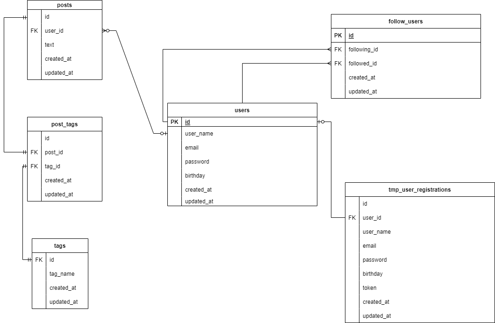
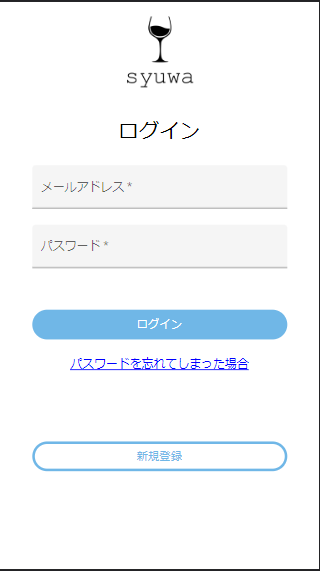
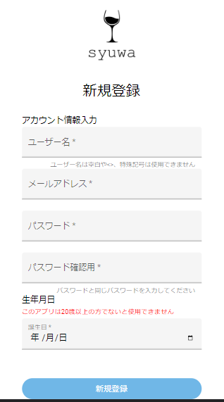
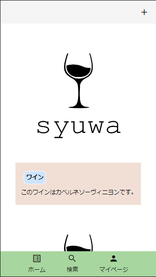
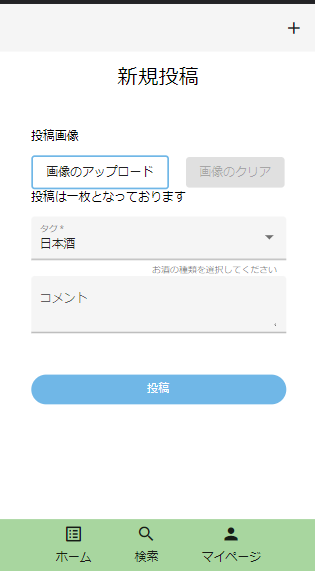
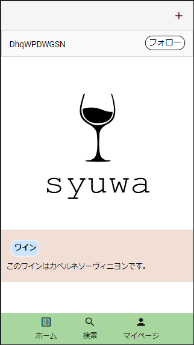
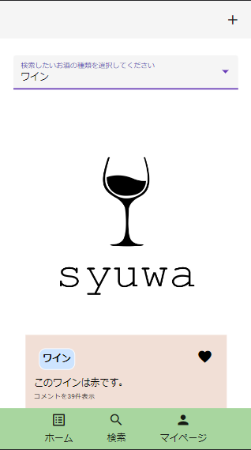
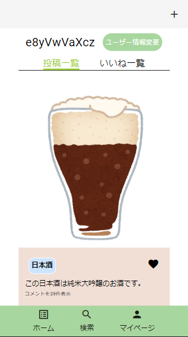
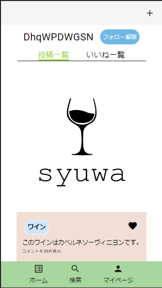
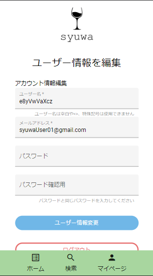

# syuwa

お酒を記録し、飲んだお酒を記録できるようにするアプリケーションです。
飲んで美味しかったお酒や自分がまた飲みたいと思えるお酒を共有できるアプリケーションとなっております。
スマホ向けの Web アプリケーションとして、作成しております。

---

## 使用技術

- PHP 8.1.13
- Laravel 9.31.0
- Node.js 16.17.0
- npm 8.15.0
- Angular 14.2.3
- Docker/Docker-compose 20.10.17/2.7.0
- Nginx 1.23.2
- MySQL 8.0.28
- PHPUnit

---

## 機能一覧

- 新規登録
  - メール送信機能
- ログイン
- ログアウト
- 投稿一覧表示機能
  - 投稿追加取得機能
- フォロー機能
  - フォロー解除
- タグ検索機能
- プロフィール表示機能
- お酒投稿機能
  - 写真投稿機能

---

## データベース設計

## 

---

## 画面一覧

- 画面はモバイル向けに作成している為、モバイルのサイズで表示

- ログイン画面

## 

- 新規登録画面

## 

- 投稿一覧

## 

- 投稿追加

## 

- 投稿詳細

## 

- 投稿検索

## 

- マイページ

## 

- ユーザーページ

## 

- ユーザー情報変更

## 
